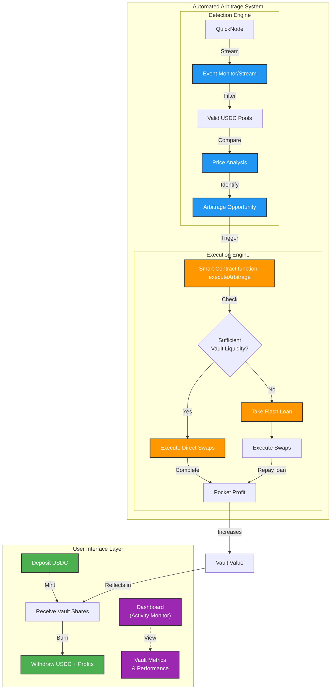

# ⚡ FlashVault

## Overview

FlashVault is a decentralized protocol that automates cross-DEX arbitrage opportunities, specifically targeting price differences between Uniswap V3 and Sushiswap pools. The protocol allows users to deposit USDC into a tokenized vault and earn yields generated from automated arbitrage trading.
By using real-time monitoring and price execution triggers, FlashVault provides users with automated, reliable, and secure arbitrage-driven yield generation.


## Key Features

### User-Focused
- **Transparent & Accessible**: Open participation via USDC deposits with traceable vault performance via on-chain data.
- **Automated Yields**: Benefit from profitable arbitrage without active management.
- **Seamless Withdrawals**: Withdraw funds anytime using vault shares.

### Protocol Mechanics
- **Real-Time Monitoring**: Real-time DEX price and liquidity tracking through QuickNode, which feeds data into our detection engine.
- **Gas Optimization**: Efficient execution logic to maximize net profits by reducing transaction costs.
- **Risk Management**: Built-in profit thresholds and liquidity validation to minimize exposure.
- **Flash Loan Integration**: Supports capital-efficient trading by using flash loans for larger arbitrage opportunities.


## Arbitrage Strategy
FlashVault focuses on a single, strategic approach: **Buy Low, Sell High** between USDC pairs on Uniswap V3 and SushiSwap.

1. **Price Monitoring**  
   - QuickNode streams capture DEX events and market fluctuations.
   - Validates liquidity to ensure trade viability.

2. **Trade Execution**  
   - Detects when an asset is undervalued on one DEX and overvalued on another.
   - Runs profit calculations, considering fees and gas costs.
   - Executes a buy from the lower-priced DEX and a simultaneous sell on the higher-priced DEX, optimizing for profit.

3. **Capital Efficiency**  
   - Uses flash loans for larger trades when advantageous, eliminating the need for collateral.
   - Ensures instant repayment post-trade to manage loan exposure.


## Architecture

### Protocol Workflow

1. **Real-Time Monitoring**
   - Leveraging **QuickNode Streams** for constant DEX event monitoring.
   - Tracks price movements, liquidity changes, and swap events to capture arbitrage triggers.

2. **Event Decoding & Price Calculation**
   - **QuickNode Functions** process events and calculate potential price discrepancies.
   - Ensures accuracy and optimizes execution timing by detecting when asset prices diverge across DEXs.

3. **Execution Trigger**
   - Executes trades once profit conditions are met, minimizing transaction time.
   - Uses the **executeArbitrage** function to initiate the arbitrage, with profit threshold and liquidity checks in place.

4. **Profit Distribution**
   - Net profits are distributed to vault shareholders.


## Technical Architecture


### Smart Contract Overview
The FlashVault smart contract layer is designed to manage user interactions, facilitate automated arbitrage trading, and optimize capital efficiency. It adheres to the ERC4626 standard, enabling a tokenized vault structure that allows users to deposit and withdraw USDC while benefiting from automated yield generation through arbitrage opportunities.

**Smart Contract Layer*
- ERC4626 Tokenized Vault 
  - **Deposit**: Allows users to deposit USDC into the vault, minting corresponding vault shares.
  - **Withdraw**: Enables users to withdraw their assets based on the number of shares they hold.
  - **Flash Loan Execution**: Manages flash loans from Aave to execute larger trades without collateral, ensuring efficient capital use in arbitrage opportunities
  - **Execute Trade**: Handles the actual trading operations between DEXs, ensuring the execution of trades.
  - **Profit Distribution**: Allocates net profits from arbitrage trades to vault shareholders, ensuring that returns are transparently shared among users.

For reference, you can view the [deployed contract](https://sepolia.etherscan.io/address/0x207ABAcEe3Be9EFEf87c600Dcd2C0511b659B050).
    
#### Backend Overview

**Monitoring Layer**
- Arbitrage Detection Engine  
  - **Log Decoder**: Decodes incoming event data.
  - **Price Calculator**: Real-time asset price calculation.
  - **Arbitrage Checker**: Validates if price differences are profitable.
  - **Execution Trigger**: Initiates arbitrage in smart contract if conditions are met.





The FlashVault contract is built on the following standards, libraries and protocols:

- **ERC4626**: Ensures compatibility and standardization for yield-bearing vaults.
- **OpenZeppelin**: Trusted libraries provide secure token management and reentrancy protection.
- **Aave**: Supports instant, collateral-free borrowing to enable quick execution of profitable trades.
- **Uniswap**: Enables seamless interaction with the Uniswap decentralized exchange, facilitating efficient asset swaps and liquidity provision.

### Key Functions

- **[Deposit](https://github.com/0xChijioke/flash/blob/main/packages/hardhat/contracts/FlashVault.sol#L105)**: Users can deposit USDC and receive shares in return.
  ```solidity
  function userDeposit(uint256 assets) external returns (uint256 shares);
  ```

- **[Withdraw](https://github.com/0xChijioke/flash/blob/main/packages/hardhat/contracts/FlashVault.sol#L120)**: Users can withdraw their assets based on their shares.
  ```solidity
  function userWithdraw(uint256 shares) external returns (uint256 assets);
  ```


- **[Execute Arbitrage](https://github.com/0xChijioke/flash/blob/main/packages/hardhat/contracts/FlashVault.sol#L171)**: Initiates arbitrage trade between specified DEX pools to capture profitable opportunities.
  ```solidity
  function executeArbitrage(
		address _pool0,
		address _pool1,
		address _tokenOut,
		uint256 _amount,
     	bool _isToken0USDC
	) external onlyFlashFunction;
  ```


- **[Execute Trade](https://github.com/0xChijioke/flash/blob/main/packages/hardhat/contracts/FlashVault.sol#L203)**: Internal function that performs trade operations between specified pools.
  ```solidity
  function _executeTrade(
		address pool0,
		address pool1,
		address tokenOut,
		uint256 amount,
     	bool isToken0USDC
	) internal;
  ```

 ## QuickNode Serverless Function
   The QuickNode FlashVault function is designed to facilitate real-time interactions with the FlashVault contract, enabling efficient monitoring of on-chain events and execution of arbitrage opportunities. This serverless function leverages Ethers.js v6 for seamless integration with Ethereum smart contracts, ensuring fast and secure operations. Below are the key functions included in this module:

### Key Functions

- **handleLogs**: Processes filtered logs from blockchain events to identify relevant pools.
  ```javascript
  async function handleLogs(filteredLogs)
  ```

- **handleSwap**: Manages the logic for analyzing swap events and determining potential arbitrage opportunities across multiple DEXs.
  ```javascript
  async function handleSwap(poolDetails)
  ```

- **checkForArbitrage**: Evaluates prices between pools to identify arbitrage opportunities, considering liquidity and price thresholds.
  ```javascript
  function checkForArbitrage(pools)
  ```

- **triggerArbitrageExecution**: Initiates the execution of an arbitrage trade based on identified opportunities, interacting directly with the FlashVault contract to carry out the transaction.
  ```javascript
  async function triggerArbitrageExecution({ buyPool, sellPool, tradeAmount })
  ```


## Limitations

- **Deployment Environment**: FlashVault’s detection engine processes events and pools on the Ethereum Mainnet. However, the contract is currently deployed on the [Sepolia testnet](https://sepolia.etherscan.io/address/0x207ABAcEe3Be9EFEf87c600Dcd2C0511b659B050) for demonstration purposes. Arbitrage opportunities identified on the Mainnet are simulated on Sepolia using hardcoded DEX pools instead of live Mainnet pools.

- **Unaccounted Costs**: The current implementation does not yet factor in potential slippage, transaction fees, or gas costs during trade execution. This could impact the profitability of arbitrage trades and should be considered in future updates.

- **Event Monitoring Scope**: The detection engine currently only listens for swap events on the DEXs. This limited scope may result in missed opportunities if price changes occur outside of swap events or if liquidity shifts happen without corresponding trades.


## Future Roadmap

FlashVault’s roadmap includes expanding trading strategies, enhancing risk management, optimizing performance, and improving accessibility. Planned enhancements include:

1. **Additional Trading Strategies**  
   - **Multi-Hop Arbitrage**: Leverages multi-step trades across different assets.
   - **Cross-Chain Arbitrage**: Expands arbitrage to include cross-chain opportunities and liquidity utilization.

2. **Technical Enhancements**  
   - **Advanced Risk Management**: Adaptive thresholds, slippage controls, and dynamic position sizing.
   - **Performance Optimization**: MEV protection, parallel execution, and gas cost reductions.
   - **Infrastructure Improvements**: Integration of advanced analytics, enhanced monitoring, etc.

3. **Protocol Expansion**  
   - **Additional DEX Integrations**: Supports more DEX protocols for increased reach and flexibility.
   - **Yield Optimization**: Idle fund utilization through yield farming and compounding strategies.


## Getting Started

### Requirements

- Node.js (>= v18.18)
- Yarn
- Git

### Quickstart

1. Clone the repository and install dependencies:
   ```bash
   git clone https://github.com/0xChijioke/flash.git
   cd flash
   yarn install
   ```

2. Run a local Ethereum network:
   ```bash
   yarn chain
   ```

3. Deploy the smart contract:
   ```bash
   yarn deploy
   ```


---

⚠️ **Disclaimer: This application is a prototype for demonstration only. It is not production-ready.**
